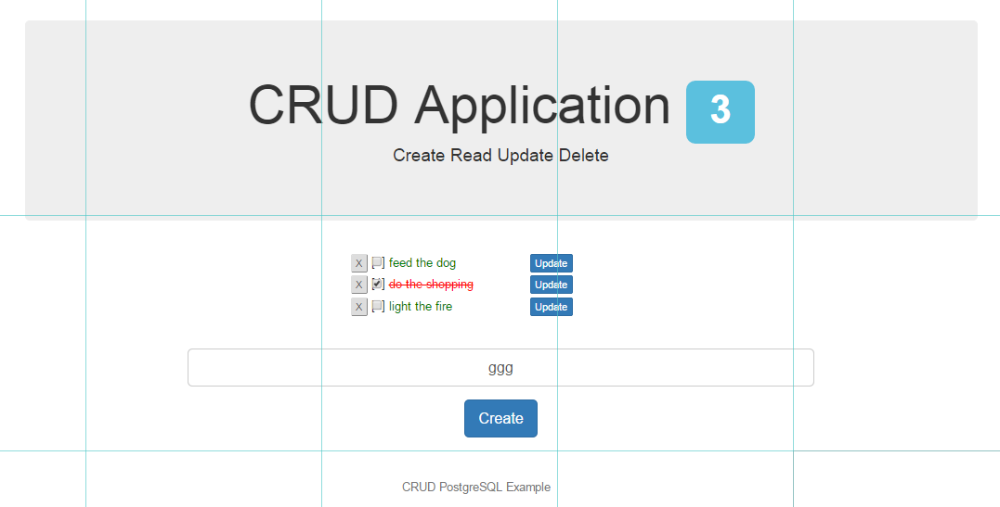

# Node, Express, Postgres, Angular - CRUD Example

This example was forked and used in [Docker para desenvolvedores Javascript / Node.JS](http://www.videosdeti.com.br/curso-docker-nodejs.html) course.

## Starts cloning this project

* Just clone

```bash
  git clone https://github.com/jacksonpires/crud-node-postgres.git
```

## Steps to prepare Docker container

* Run postgres container and verify Ports and IP Address

Linux

```bash
  mkdir postgres_data
  docker run -v $(pwd)/postgres_data:/var/lib/postgresql/data -e POSTGRES_PASSWORD=mysecretpassword -d -P postgres
  docker port <CONTAINER ID>
  docker container inspect --format '{{.NetworkSettings.IPAddress}}' <CONTAINER ID>
```

Windows

```powershell
  mkdir postgres_data
  docker run -v %cd%/postgres_data:/var/lib/postgresql/data -e POSTGRES_PASSWORD=mysecretpassword -d -P postgres
  docker port <CONTAINER ID>
  docker container inspect --format '{{.NetworkSettings.IPAddress}}' <CONTAINER ID>
```

* Use [pgAdmin](https://www.pgadmin.org/) to connect and create a database with name **crud-node**

* Run Cloud9 container

Linux

```bash
  docker run -d -v $(pwd)/crud-node-postgres:/workspace -p 8181:8181 -p 3090:3090 rafaelmouradev/cloud9 --auth username:password
```

Windows

```powershell
  docker run -d -v %cd%/crud-node-postgres:/workspace -p 8181:8181 -p 3090:3090 rafaelmouradev/cloud9 --auth username:password
```

* Browse to **[http:localhost:8181](http://localhost:8181)** to go inside Cloud9 container

## On Cloud9 container run

* Install Bower
  
```bash
  npm install -g bower
```

* Install all the node packages listed in the package.json

```bash
  npm install
```

* Installs the front end packages listed in the bower.json file
  
```bash
 bower install --allow-root
```

* Open **../server/config/database.js** and complete PostgreSQL database connection details

* Prepare the database (create table and populate)
  
```bash
  node db_setup/prepare.js
```

* Start the node project
  
```bash
  node server.js
```

* Browse to **[http://localhost:3090](http://localhost:3090)**

## Screenshot


